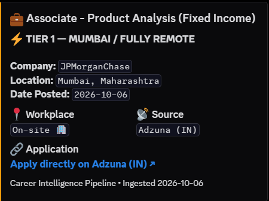
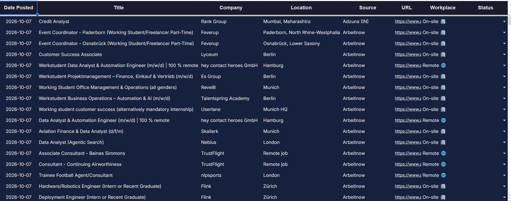

# Insider

### Say bye-bye to unemployment and hello to job postings 👋

An automated job-sourcing pipeline that scrapes 7 sources every 30 minutes, filters for the roles you actually want, and delivers leads straight to your Discord and Google Sheets — so you can focus on applying, not searching.

[](./LICENSE)
[](https://www.python.org/)
[](./.github/workflows/sourcing.yml)

---

## What it looks like

### Discord alerts

Every new lead lands in your Discord channel with a tier badge, company, location, and a direct apply link.



### Google Sheets tracker

All leads are also logged to a Google Sheet with dark theme formatting, status dropdowns (Applied / Interviewing / Offered / Rejected / Ghosted), and auto-ghosting after 3 weeks of no activity.



---

## What is Insider?

Insider is a fully automated job-sourcing pipeline built for people who are tired of manually checking 10 different job boards every day. You configure it once with the roles, seniority, and locations you want — and it runs on GitHub Actions every 30 minutes, for free.

It scrapes real company career pages (Greenhouse, Lever, Ashby) and aggregators (Remotive, Arbeitnow, WeWorkRemotely, Adzuna), filters out noise, deduplicates across runs so you never see the same job twice, and delivers matching leads to Discord and Google Sheets.

---

## How it works

1. **Scrape** — Fetches jobs from 7 sources (54+ company boards + 4 aggregators)
2. **Filter** — Matches against your target roles, blocks senior/noise titles, enforces a YOE cap (≤ 2 years)
3. **Classify** — Assigns a priority tier based on location
4. **Dedupe** — Checks against `data/seen.json` so you never get the same job twice
5. **Deliver** — Posts new leads to Discord with tier-coded embeds, logs them to Google Sheets

```
Sources (7)                     Filters                        Sinks
───────────                     ───────                        ─────
Greenhouse (34 boards)  ──┐     Role keyword match      ┌───→ Discord
Lever (10 boards)       ──┤     Seniority block         │     tier-coded embeds
Ashby (10 boards)       ──┤     Noise exclusion         │
Remotive                ──┼──→  YOE cap (≤ 2)       ──→ ├───→ Google Sheets (optional)
Arbeitnow               ──┤     Geo-fence detection     │     auto-updating tracker
WeWorkRemotely          ──┤     Tier classification     │
Adzuna (IN + GB)        ──┘     Cross-run dedupe        └───→ All tiers posted
```

---

## Tier system

| Tier | Badge | Criteria | Example |
|---|---|---|---|
| **High Priority** | 🚀 Remote | Genuinely remote — worldwide or India, no western geo-fence | "Remote — Worldwide" |
| **Tier 1** | ⚡ Mumbai | Mumbai, Vasai, Thane, Navi Mumbai — commutable | "Mumbai, Maharashtra" |
| **Tier 2** | 🌍 International | Global on-site or geo-fenced remote (US, UK, EU) | "London, UK" |
| **Tier 3** | 🇮🇳 Pan India | Rest of India on-site | "Bangalore, Karnataka" |

Internships with conversion/PPO signals get a 🎓 badge.

---

## How to use

### 1. Fork and clone

```bash
git clone https://github.com/YOUR_USERNAME/Insider.git
cd Insider
python -m venv venv
source venv/bin/activate   # Windows: .\venv\Scripts\activate
pip install -r requirements.txt
cp .env.example .env       # fill in your keys
```

### 2. Configure your secrets

| Variable | Required | Where to get it |
|---|---|---|
| `DISCORD_WEBHOOK_URL` | Yes | Channel settings → Integrations → Webhooks |
| `ADZUNA_APP_ID` | No | [developer.adzuna.com](https://developer.adzuna.com/) (free) |
| `ADZUNA_APP_KEY` | No | Adzuna source skipped if not set |
| `SHEET_ENABLED` | No | Set to `true` to enable Google Sheets |
| `GOOGLE_SHEET_WEBHOOK` | No | Apps Script web app URL (see `apps_script/Code.gs`) |

### 3. Customize for your search

Edit these three files — no code changes needed:

- **`config.json`** — target role keywords (what job titles to match)
- **`config/filters.yaml`** — seniority rules, noise exclusions, location tiers
- **`config/companies.yaml`** — Greenhouse/Lever/Ashby board slugs

### 4. Run

```bash
python main.py --dry-run    # scrape + print, no posting
python main.py --once       # real run — posts to Discord + Sheets
```

### 5. Automate with GitHub Actions

Add your secrets under **Settings → Secrets and variables → Actions**, and the included workflow runs every 30 minutes automatically.

For the full walkthrough, see **[SETUP.md](./SETUP.md)**.

---

## Adapt Insider with AI

Don't have Claude Code? Copy this prompt into any AI assistant (Claude, ChatGPT, etc.) to get help customising Insider for your niche:

<details>
<summary>Click to expand prompt</summary>

```
I forked the Insider job-sourcing pipeline (https://github.com/zshqv/Insider).
It scrapes 7 job board APIs, filters by role/seniority/location, and posts
matching jobs to Discord.

Help me customise it for my job search. Here's what I'm looking for:

- Roles: [e.g. "software engineer", "data scientist", "product manager"]
- Seniority: [e.g. "entry-level only", "mid-level", "any"]
- Locations I want (Tier 1 priority): [e.g. "San Francisco", "New York"]
- Other acceptable locations (Tier 2): [e.g. "Seattle", "Austin", "Remote US"]
- Industries/fields to EXCLUDE from results: [e.g. "finance", "healthcare"]

Based on this, generate:
1. An updated config.json with my target roles
2. An updated config/filters.yaml with my seniority rules, noise exclusions,
   and location tiers
3. An updated config/companies.yaml with relevant company board slugs
   (Greenhouse/Lever/Ashby) for my target industry
4. Any changes needed in insider/sources/adzuna.py (categories and countries)

Keep the same file structure and format as the originals in the repo.
```

</details>

---

## Job boards

| Source | Type | Cost | What it scrapes |
|---|---|---|---|
| Greenhouse | Direct career portal | Free | 34 company boards (Stripe, Razorpay, Coinbase, etc.) |
| Lever | Direct career portal | Free | 10 company boards |
| Ashby | Direct career portal | Free | 10 company boards |
| Remotive | Aggregator | Free | Remote finance/legal jobs |
| Arbeitnow | Aggregator | Free | EU + global jobs |
| WeWorkRemotely | Aggregator | Free | Remote finance/legal RSS feed |
| Adzuna | Aggregator | Free (2,500 calls/mo) | India + GB finance jobs |

**Everything is free.** No paid APIs, no premium tiers. Adzuna has a free tier of 2,500 calls/month — at 48 runs/day that's ~1,440 calls/month, well within limits.

---

## Schedule

| What | When |
|---|---|
| Pipeline runs | Every 30 minutes via GitHub Actions cron |
| Dedupe retention | 180 days (seen jobs auto-expire) |
| Auto-ghost (Sheets) | 3 weeks with no status update → marked Ghosted |
| Recency window | Last 30 days (older job postings are skipped) |

---

## Architecture

```
┌─────────────────────────────────────────────────────────────────┐
│                      GitHub Actions (cron)                       │
│                       every 30 minutes                          │
└──────────────────────────┬──────────────────────────────────────┘
                           │
                    python main.py --once
                           │
          ┌────────────────▼────────────────┐
          │         Source Registry          │
          │   insider/sources/__init__.py    │
          │                                 │
          │  Greenhouse ─── 34 boards       │
          │  Lever ──────── 10 boards       │
          │  Ashby ──────── 10 boards       │
          │  Remotive ───── finance/legal   │
          │  Arbeitnow ──── EU/global       │
          │  WWR ────────── remote RSS      │
          │  Adzuna ─────── IN + GB         │
          └────────────────┬────────────────┘
                           │
          ┌────────────────▼────────────────┐
          │         Filter Pipeline          │
          │     insider/filters.py           │
          │                                 │
          │  1. Role keyword match           │
          │  2. Seniority block (sr, mgr..)  │
          │  3. Noise block (eng, design..)  │
          │  4. YOE cap (≤ 2 years)          │
          │  5. Tier classification           │
          └────────────────┬────────────────┘
                           │
          ┌────────────────▼────────────────┐
          │           Dedupe                 │
          │     insider/dedupe.py            │
          │                                 │
          │  data/seen.json (Actions cache)  │
          │  Key: source:id + url:normalized │
          │  Retention: 180 days             │
          └────────────────┬────────────────┘
                           │
              ┌────────────┴────────────┐
              │                         │
    ┌─────────▼─────────┐    ┌─────────▼─────────┐
    │    Discord Sink    │    │  Google Sheets     │
    │                    │    │  (optional)        │
    │  Tier-coded embeds │    │  Apps Script       │
    │  Rate-limit aware  │    │  webhook receiver  │
    │  3 retries         │    │  Status dropdowns  │
    └────────────────────┘    └────────────────────┘
```

---

## Project structure

```
├── main.py                    Entry point
├── config.json                Target roles, locations, limits
├── config/
│   ├── companies.yaml         Company boards (Greenhouse/Lever/Ashby slugs)
│   └── filters.yaml           Seniority rules, tiers, geo-fence, badges
├── insider/
│   ├── sources/               One module per source (7 total)
│   ├── filters.py             Role filter + tier classifier
│   ├── dedupe.py              Cross-run deduplication (data/seen.json)
│   ├── sinks/sheet.py         Google Sheets sink
│   └── util.py                Env helpers, secret redaction
├── apps_script/Code.gs        Google Sheets webhook receiver
├── assets/                    Screenshots for README
├── .env.example               Template for local secrets
└── .github/workflows/         GitHub Actions cron
```

---

## License

MIT © [ashu](./LICENSE)
